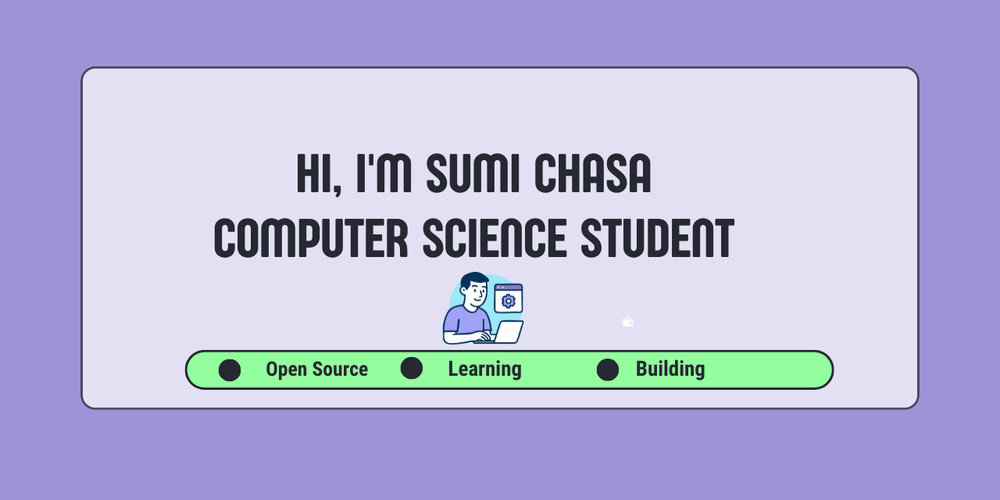

  

## 👩‍💻 About Me

- 🎓 B.Tech Computer Science & Engineering student at **Barak Valley Engineering College (BVEC), Assam**
- 💼 Former Research Intern at **IIIT Guwahati**
- 💻 Full-Stack Developer with **Python, FastAPI, React, and MongoDB**
- 🚀 Passionate about learning and building real-world applications

## 🌟 Current Interests

- 🤖 Artificial Intelligence & Machine Learning
- 🧠 Deep Learning & NLP
- 🔐 Cryptography & Secure Systems
- 🌐 Full-Stack Development

## 🛠️ Tech Stack

  

## 🚀 Featured Projects

### 🔐 OpaqueID

Privacy-preserving authentication using the OPAQUE protocol.

### 📝 nanoTagore

A Small Language Model inspired by nanoGPT for Bengali poetry generation.

## 🔥 GitHub Streak

  

## 🌐 Connect with Me

  

  

  

  

